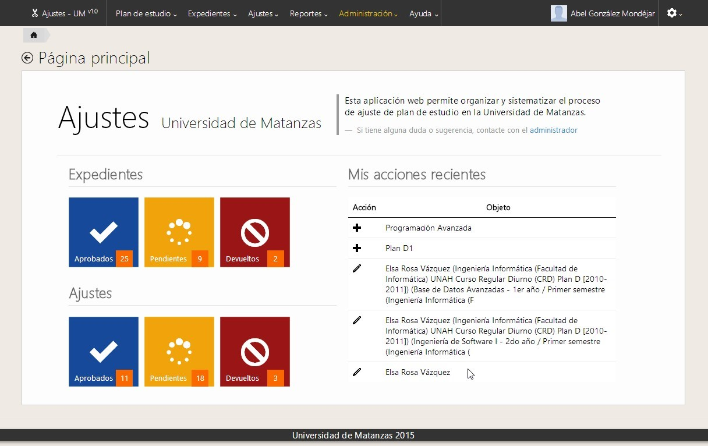
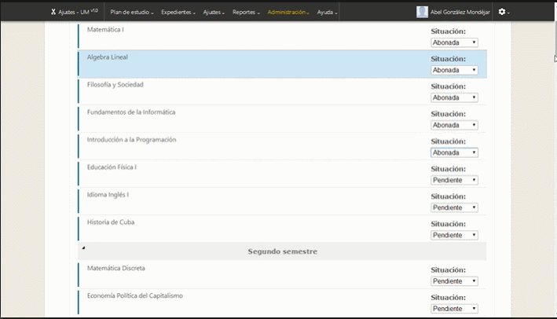
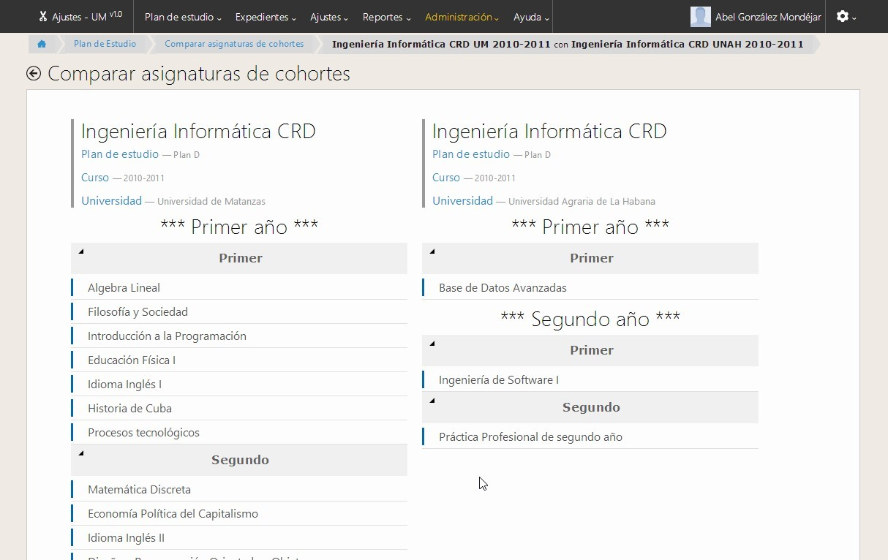
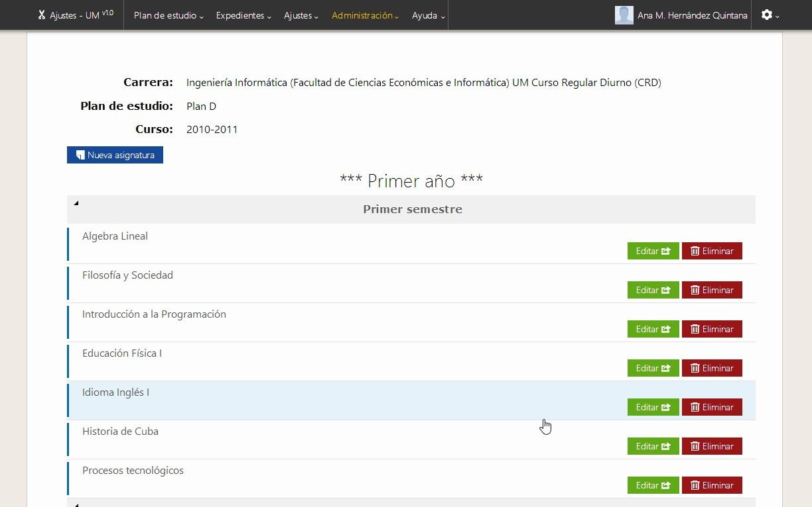
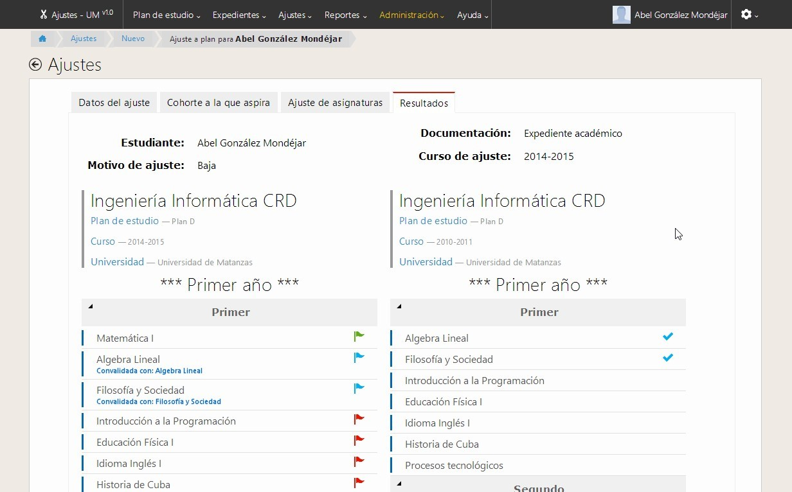
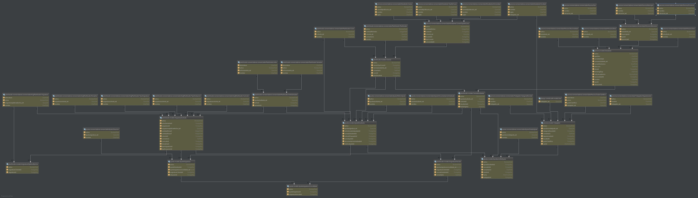
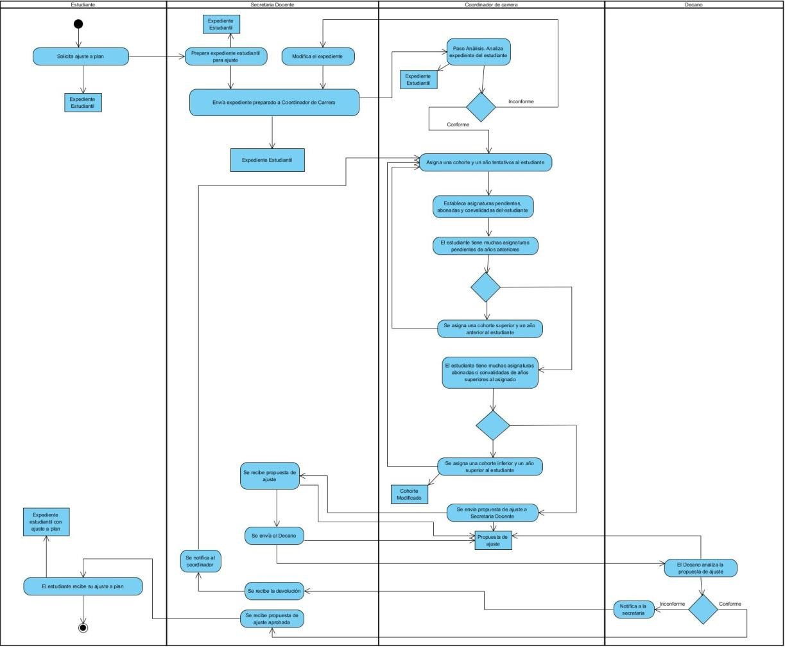

## 🙋‍♂️ Hi there, currently I'm updating this file 🧑‍💻

<h1 align="center">
  
  <p>Ajustes </p>
</h1>

---

<br>

<h1 align="center">
  
</h1>

---
## 🧾 About
**Ajustes** is a Python-Django project to facilitate the process of adjusting curriculum in Universities. This project was part of my Engineeer thesis and was tested in Universidad de Matanzas's in Cuba. In this work, I could execute all software development cycle since scratch until the final deliver to user using agile methodology XP.

---
## 🧾 Screenshots
**Home**
<h1>
  
</h1>

**Cohort 1**
<h1>
  
</h1>

**Cohort 2**
<h1>
  
</h1>

**Final result**
<h1>
  
</h1>

**Database**
<h1>
  
</h1>

**Workflow**
<h1>
  
</h1>


---
## ✅ Main features
**Career cordinator**
- [x] CRUD Study Plan
- [x] CRUD Cohort
- [x] CRUD Topic
- [x] CRUD Student history

---
## 🔧 Technology

- [Python](https://www.python.org/) 
- [Django](https://www.djangoproject.com/) 💚
- [Apache](https://httpd.apache.org/)
- [MySQL](https://www.mysql.com/)

---
## 👨‍💻 How to Setup

```bash
  # Clone the project
  $ git clone https://github.com/abelgonzalez/Ajustes.git
```
```bash
  # Enter directory
  $ cd Ajustes
```

Download and install:

 - [XAMPP for Windows 7.4.29](https://www.apachefriends.org/download.html)
  
 - [Python 3.7.7](https://www.python.org/downloads/release/python-377/)

 - [Django 3.2.13](https://www.djangoproject.com/download/3.2.13/tarball/) 
   or
  ```bash
    # Clone the project
    $ pip install Django==3.2.13
  ```
  
- [Visual Studio Code 1.67.2](https://code.visualstudio.com/Download)

- [Microsoft C++ Build Tools](https://visualstudio.microsoft.com/visual-cpp-build-tools/)

- On your system you would do this by running this in your command prompt:
```bash     
    $ set "MOD_WSGI_APACHE_ROOTDIR=C:\xampp\apache"
  ```
-  Install mod_wsgi 4.9.2
   ```bash
    # Install the last version
    $ pip install mod_wsgi
   ```
  

- You can add WSGIScriptAlias /mysite "C:/xampp/htdocs/wsgi/scripts/mysite.wsgi" in wsgi.conf to run http://YOURSITE/mysite, or you can just run http://YOURSITE/wsgi/mysite.wsgi
Relaunch apache if necessary.
  
- At the end of file C:\xampp\apache\conf\httpd.conf , add the following:
  AddHandler cgi-script .py
  ScriptInterpreterSource Registry-Strict
- Locate <IfModule dir_module> label and add **index.py** at right of **home.htm**
- Save the httpd.conf changes
  
- Open MySQL and import the database file **ajustes_bd.sql** in the project source.
  Database name: ajustes_UM
  utf: utf8_spanish_ci
  
  
 - Go to project root folder (**tesis**)
  ```bash
    # Run
    $ python manage.py migrate
    $ python manage.py makemigrations
    $ python manage.py migrate
  ```
  
 - Finally, in root folder (**tesis**) run:
  ```bash
    # Run
    $ python manage.py runserver 8000
  ```
  


  
---
## 😎 How to Execute


- Open Unity and load the project from **ajustes_UM** folder.

**Play game from exe**
* With Kinect:
  - Download and install [Kinect for Windows Software Development Kit (SDK) 2.0](https://www.microsoft.com/en-us/download/details.aspx?id=44561)

  - Open **Build** folder and execute "Skull Survival.exe"

* Without Kinect: 
  - Open **Build** folder and execute "Skull Survival.exe"

## 👉 Additional information
* App Demo https://youtu.be/4jX4oDhjTtc
* Technical and User's Manual is avaliable in [Doc](https://github.com/abelgonzalez/Ajustes/tree/main/Doc) folder (in spanish).
* In case of sensitive bugs like security vulnerabilities, don't hesitate to get in touch with abelgodev@gmail.com directly instead of using issue tracker. I value your effort to improve the security and privacy of this project!

---
## 📝 License

This project is under the MIT license. See the file <a href="https://github.com/abelgonzalez/Ajustes/LICENSE">LICENCE</a> for more details.

---
## 🧑‍💻 Autor
<p align="center">Done with 💙 by Abel González Mondéjar</p>


[](https://www.linkedin.com/in/abelgonzalezmondejar/)
